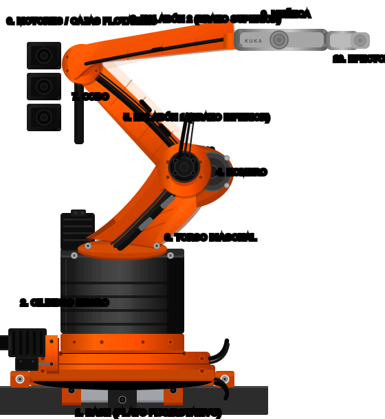

# Guía de Reparación: KUKA Robot SVG vs Original

Este documento contiene el análisis comparativo entre el estado actual del diseño y las imágenes de referencia originales segmentadas por zona.

### 🖼️ Vista General

*Este es el modelo completo. Haz scroll más abajo para ver los detalles de cada pieza individual.*

<table align="center" width="100%">
  <tr>
    <td align="center" width="50%"><b>SVG Actual Global</b></td>
    <td align="center" width="50%"><b>Referencia Global Original</b></td>
  </tr>
  <tr>
    <td align="center"></td>
    <td align="center"></td>
  </tr>
</table>

### 🖼️ Previsualización en Vivo de Secciones

*Nota: Los gráficos SVG del lado izquierdo se actualizarán automáticamente conforme modifiquemos el archivo original `kuka_robot.svg`.*

---

## 1. Base / Plato fijo (Etiqueta 1)

<table align="center" width="100%">
  <tr>
    <td align="center" width="50%"><b>SVG Actual</b></td>
    <td align="center" width="50%"><b>Referencia Real</b></td>
  </tr>
  <tr>
    <td align="center"></td>
    <td align="center"></td>
  </tr>
</table>

* **Estado SVG Actual:** Es un rectángulo naranja simple con bordes redondeados.
* **Original / Objetivo:** El robot está montado sobre una estructura compleja deslizante (un carril o *linear track* plateado). La base naranja tiene placas metálicas adicionales, soportes en la esquina y un gran motor/caja negra robusta incrustada en la parte trasera.

---

## 2. Cilindro Rotativo y Torso Diagonal (Etiquetas 2 y 3)

<table align="center" width="100%">
  <tr>
    <td align="center" width="50%"><b>SVG Actual</b></td>
    <td align="center" width="50%"><b>Referencia Real</b></td>
  </tr>
  <tr>
    <td align="center"></td>
    <td align="center"></td>
  </tr>
</table>

* **Cilindro (2):** Un cilindro negro liso con un degradado básico en el SVG. En el original tiene un collarín grueso en la base inferior y posee conectores metálicos, tornillería expuesta y terminales de donde salen directamente cables eléctricos.
* **Torso Diagonal (3):** La pieza naranja que conecta el cilindro con el hombro. En la referencia es robusta y con canal central.

---

## 3. Eslabón 1 o Brazo Inferior (Etiquetas 4 y 5)

<table align="center" width="100%">
  <tr>
    <td align="center" width="50%"><b>SVG Actual</b></td>
    <td align="center" width="50%"><b>Referencia Real</b></td>
  </tr>
  <tr>
    <td align="center"></td>
    <td align="center"></td>
  </tr>
</table>

* **Volumen y Forma:** En el original es mucho más ancho (robusto) en la parte inferior y se va afinando.
* **Cables:** En el SVG los cables son líneas negras curvas simples. En el real, son **gruesas mangueras corrugadas** que corren a lo largo de toda la espalda del brazo, atrapadas por fuertes abrazaderas negras metálicas.
* **Detalles Adicionales:** Al original le hace falta la impresión en texto negro inclinada del logo **"KUKA"** en el costado del Eslabón 1 inferior.

---

## 4. Vista General Codo y Brazo Superior (Etiquetas 6 a 10)

<table align="center" width="100%">
  <tr>
    <td align="center" width="50%"><b>SVG Actual</b></td>
    <td align="center" width="50%"><b>Referencia Real</b></td>
  </tr>
  <tr>
    <td align="center"></td>
    <td align="center"></td>
  </tr>
</table>

* **Descripción General:** Esta vista encuadra perfectamente desde las etiquetas 6 a la 10. Muestra la integración desde los motores en el codo, el brazo superior (eslabón 2), hasta llegar a la muñeca y la pinza final. El flujo debe ser continuo y orgánico.

---

## 5. Codo y Motores Traseros (Etiquetas 6 y 7)

<table align="center" width="100%">
  <tr>
    <td align="center" width="50%"><b>SVG Actual</b></td>
    <td align="center" width="50%"><b>Referencia Real</b></td>
  </tr>
  <tr>
    <td align="center"></td>
    <td align="center"></td>
  </tr>
</table>

* **DIFERENCIA CRÍTICA:** Hay 3 módulos negros rectangulares "flotando" de forma separada a la izquierda del codo. En el real, el robot tiene un enorme bloque compacto fundido en la parte posterior del codo. Los motores están perfectamente integrados en esa carcasa trasera, no están flotando. Además, de la parte superior de ese bloque sale una manguera gruesa que hace un gran arco por encima del codo para conectarse al brazo superior.

---

## 6. Muñeca Gris y Pinza (Etiquetas 9 y 10)

<table align="center" width="100%">
  <tr>
    <td align="center" width="50%"><b>SVG Actual</b></td>
    <td align="center" width="50%"><b>Referencia Real</b></td>
  </tr>
  <tr>
    <td align="center"></td>
    <td align="center"></td>
  </tr>
</table>

* **Muñeca Gris (9):** Extremidad gris clara (casi blanca) muy redondeada, aerodinámica y pulida. La forma gris abraza internamente la pieza naranja. El rótulo de **"KUKA"** está embutido en esa carcasa.
* **Pinza / Efector Final (10):** En lugar de una pinza pequeña plana, lleva instalada una impresionante garra industrial asimétrica con **tres grandes mordazas oscuras y largas** que se proyectan hacia el frente.
